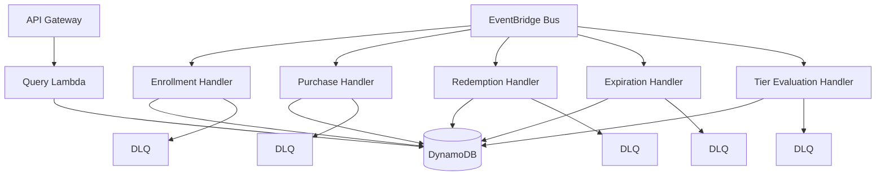

# Design Document: Rewards Program Backend

## Overview

The rewards program backend is an event-driven serverless system that manages member enrollment, star accrual, redemptions, and tier-based benefits for a casual dining rewards program. The system processes asynchronous event messages through Amazon EventBridge, maintains member state in DynamoDB, and exposes a RESTful API for queries.

The system supports three membership tiers (Green, Gold, Reserve) with differentiated star earning rates (1.0x, 1.2x, 1.7x) and expiration policies. Green members experience star expiration after 6 months without monthly activity, while Gold and Reserve members enjoy non-expiring stars. Tier promotions occur automatically based on annual star accumulation thresholds (500 stars for Gold, 2500 stars for Reserve).

Key design principles:
- Event-driven architecture for scalability and loose coupling
- Idempotent event processing to handle duplicate messages safely
- Single-table DynamoDB design for efficient access patterns
- Immutable transaction history for complete audit trail
- Sub-200ms query response times for member balance lookups

## Architecture

### System Components



### Event Flow

1. **Enrollment Flow**: Signup event → EventBridge → Enrollment Handler → Create member record in DynamoDB
2. **Purchase Flow**: Purchase event → EventBridge → Purchase Handler → Calculate stars → Update balance → Record transaction
3. **Redemption Flow**: Redemption event → EventBridge → Redemption Handler → Validate balance → Deduct stars → Record transaction
4. **Tier Evaluation Flow**: Scheduled trigger (daily) → Tier Evaluation Handler → Check annual star counts → Promote members → Update tier status
5. **Expiration Flow**: Scheduled trigger (daily) → Expiration Handler → Check Green members → Expire old stars → Update balances
6. **Query Flow**: API request → API Gateway → Query Lambda → Fetch member data from DynamoDB → Return response

### Technology Stack

- **Compute**: AWS Lambda (Python 3.11+)
- **Event Bus**: Amazon EventBridge
- **API**: Amazon API Gateway (REST API)
- **Database**: Amazon DynamoDB (single-table design)
- **Infrastructure**: AWS CDK (TypeScript)
- **Monitoring**: CloudWatch Logs, X-Ray tracing
- **Security**: IAM roles, KMS encryption, Secrets Manager

## Components and Interfaces

### Lambda Functions

#### 1. Enrollment Handler
- **Trigger**: EventBridge event (event type: `rewards.member.signup`)
- **Input**: Event message with member details (email, name, phone)
- **Output**: Success/error response with membership ID
- **Responsibilities**:
  - Generate unique membership ID (UUID)
  - Validate event message schema
  - Check for duplicate enrollments
  - Create member record with Green tier, zero balance
  - Record enrollment timestamp
  - Implement idempotency using transaction ID

#### 2. Purchase Handler
- **Trigger**: EventBridge event (event type: `rewards.transaction.purchase`)
- **Input**: Event message with membership ID, purchase amount, transaction ID, flags (double_star_day, personal_cup)
- **Output**: Success/error response with stars earned
- **Responsibilities**:
  - Validate membership ID exists
  - Calculate stars based on tier rate and multipliers
  - Update star balance atomically
  - Update last qualifying activity timestamp
  - Record transaction in history
  - Update annual star count
  - Implement idempotency using transaction ID

#### 3. Redemption Handler
- **Trigger**: EventBridge event (event type: `rewards.transaction.redemption`)
- **Input**: Event message with membership ID, stars to redeem, item description, transaction ID
- **Output**: Success/error response
- **Responsibilities**:
  - Validate membership ID exists
  - Validate sufficient star balance
  - Deduct stars atomically using conditional update
  - Record redemption transaction
  - Implement idempotency using transaction ID

#### 4. Tier Evaluation Handler
- **Trigger**: EventBridge scheduled rule (daily at 00:00 UTC)
- **Responsibilities**:
  - Query all members with tier evaluation due
  - Calculate annual star count (past 12 months)
  - Promote members meeting thresholds (500 → Gold, 2500 → Reserve)
  - Demote members below thresholds after 12-month period
  - Remove expiration dates when promoting from Green to Gold/Reserve
  - Record tier change events

#### 5. Expiration Handler
- **Trigger**: EventBridge scheduled rule (daily at 01:00 UTC)
- **Responsibilities**:
  - Query all Green tier members
  - Check last qualifying activity timestamp
  - Expire stars older than 6 months without monthly activity
  - Update star balance atomically
  - Record expiration events

#### 6. Query Handler
- **Trigger**: API Gateway HTTP GET request
- **Endpoints**:
  - `GET /v1/members/{membershipId}` - Get member balance and status
  - `GET /v1/members/{membershipId}/transactions` - Get transaction history
- **Output**: JSON response with member data
- **Responsibilities**:
  - Validate membership ID
  - Fetch member record from DynamoDB
  - Fetch transaction history with pagination
  - Return response within 200ms SLA

### Event Schemas

#### Signup Event
```json
{
  "eventType": "rewards.member.signup",
  "transactionId": "uuid",
  "timestamp": "ISO8601",
  "data": {
    "email": "string",
    "name": "string",
    "phone": "string"
  }
}
```

#### Purchase Event
```json
{
  "eventType": "rewards.transaction.purchase",
  "transactionId": "uuid",
  "timestamp": "ISO8601",
  "data": {
    "membershipId": "uuid",
    "amount": "decimal",
    "doubleStarDay": "boolean",
    "personalCup": "boolean"
  }
}
```

#### Redemption Event
```json
{
  "eventType": "rewards.transaction.redemption",
  "transactionId": "uuid",
  "timestamp": "ISO8601",
  "data": {
    "membershipId": "uuid",
    "starsToRedeem": "integer",
    "itemDescription": "string"
  }
}
```

### API Schemas

#### Member Response
```json
{
  "membershipId": "uuid",
  "tier": "Green|Gold|Reserve",
  "starBalance": "integer",
  "annualStarCount": "integer",
  "enrollmentDate": "ISO8601",
  "lastActivity": "ISO8601",
  "tierSince": "ISO8601"
}
```

#### Transaction History Response
```json
{
  "transactions": [
    {
      "transactionId": "uuid",
      "type": "purchase|redemption|expiration|tier_change",
      "timestamp": "ISO8601",
      "starsEarned": "integer",
      "starsRedeemed": "integer",
      "purchaseAmount": "decimal",
      "description": "string"
    }
  ],
  "nextToken": "string"
}
```

## Data Models

### DynamoDB Single-Table Design

**Table Name**: `rewards-program`

**Primary Key**: 
- Partition Key (PK): `string`
- Sort Key (SK): `string`

**Global Secondary Indexes**:
1. **GSI1**: For querying by tier and evaluation date
   - PK: `GSI1PK` (tier)
   - SK: `GSI1SK` (next evaluation date)
2. **GSI2**: For querying by transaction ID (idempotency)
   - PK: `GSI2PK` (transaction ID)
   - SK: `GSI2SK` (timestamp)

### Access Patterns

| Pattern | PK | SK | Index |
|---------|----|----|-------|
| Get member by ID | `MEMBER#{id}` | `PROFILE` | Primary |
| Get member transactions | `MEMBER#{id}` | `TXN#{timestamp}` | Primary |
| Get members by tier for evaluation | `TIER#{tier}` | `EVAL#{date}` | GSI1 |
| Check transaction idempotency | `TXN#{txnId}` | `{timestamp}` | GSI2 |

### Entity Schemas

#### Member Profile Record
```
PK: MEMBER#{membershipId}
SK: PROFILE
membershipId: uuid
email: string
name: string
phone: string
tier: Green|Gold|Reserve
starBalance: number
annualStarCount: number
enrollmentDate: ISO8601
lastQualifyingActivity: ISO8601
tierSince: ISO8601
nextTierEvaluation: ISO8601
GSI1PK: TIER#{tier}
GSI1SK: EVAL#{nextTierEvaluation}
```

#### Transaction Record
```
PK: MEMBER#{membershipId}
SK: TXN#{timestamp}#{transactionId}
transactionId: uuid
type: purchase|redemption|expiration|tier_change
timestamp: ISO8601
starsEarned: number (optional)
starsRedeemed: number (optional)
purchaseAmount: number (optional)
description: string
GSI2PK: TXN#{transactionId}
GSI2SK: {timestamp}
ttl: epoch (30 days for idempotency records)
```

#### Star Ledger Record (for Green members)
```
PK: MEMBER#{membershipId}
SK: STAR#{earnedDate}#{batchId}
earnedDate: ISO8601
starCount: number
expirationDate: ISO8601 (null for Gold/Reserve)
```

### Star Expiration Strategy

For Green tier members, stars are tracked in batches by earning date. Each purchase creates a star ledger entry. The expiration handler:
1. Queries all star ledger entries for Green members
2. Checks if last qualifying activity is within the past month
3. If no monthly activity, expires stars older than 6 months
4. Deletes expired ledger entries and updates star balance

For Gold/Reserve members, no star ledger entries are created since stars don't expire.


## Correctness Properties

*A property is a characteristic or behavior that should hold true across all valid executions of a system-essentially, a formal statement about what the system should do. Properties serve as the bridge between human-readable specifications and machine-verifiable correctness guarantees.*

### Property Reflection

After analyzing all acceptance criteria, I identified several areas of redundancy:

- Properties 1.2, 1.3, 1.4 can be combined into a single property about member initialization
- Properties 2.1 and 2.2 are redundant - both test invalid membership ID validation
- Properties 2.4 and 2.5 can be combined - calculating and adding stars is one operation
- Properties 3.1, 3.2, 3.3 can be combined into one property about tier-based rates
- Properties 4.1, 4.2, 4.3 overlap - validation of membership and balance can be one property
- Properties 4.4 and 4.5 can be combined - deducting and recording is one operation
- Properties 6.2 and 6.4 overlap - expiration logic includes balance deduction
- Properties 7.1 and 7.2 can be combined - non-expiration for Gold/Reserve is one rule
- Properties 8.1, 8.2, 8.3 can be combined - query returns all member data
- Properties 9.1 and 9.2 are redundant - both test missing field validation
- Properties 10.2 and 10.3 are redundant - idempotency includes not modifying balance
- Properties 11.1, 11.2, 11.3, 11.4 can be combined - all transactions are recorded with required fields

### Property 1: Member Enrollment Creates Valid Profile

*For any* valid signup event with unique membership data, processing the event should create a member record with a unique membership ID, Green tier status, zero star balance, and enrollment timestamp.

**Validates: Requirements 1.1, 1.2, 1.3, 1.4**

### Property 2: Duplicate Enrollment Rejection

*For any* membership ID that already exists, attempting to enroll again with that ID should return an error without creating a duplicate member record.

**Validates: Requirements 1.5**

### Property 3: Invalid Membership ID Rejection

*For any* purchase or redemption event with a non-existent membership ID, the system should return an error indicating member not found without processing the transaction.

**Validates: Requirements 2.1, 2.2, 4.1**

### Property 4: Purchase Updates Balance and Activity

*For any* valid purchase event for an existing member, processing the event should increase the star balance by the calculated amount, record the transaction with timestamp and amount, and update the last qualifying activity timestamp.

**Validates: Requirements 2.3, 2.5, 2.6**

### Property 5: Tier-Based Star Calculation

*For any* purchase amount and member tier (Green, Gold, or Reserve), the calculated stars should equal the purchase amount multiplied by the tier rate (1.0, 1.2, or 1.7 respectively).

**Validates: Requirements 2.4, 3.1, 3.2, 3.3**

### Property 6: Double Star Day Multiplier

*For any* purchase event marked as a double star day, the calculated stars should be exactly twice the base tier-calculated amount.

**Validates: Requirements 3.4**

### Property 7: Personal Cup Multiplier

*For any* purchase event marked with personal cup usage, the calculated stars should be exactly twice the base tier-calculated amount.

**Validates: Requirements 3.5**

### Property 8: Redemption Validation and Processing

*For any* redemption event, if the member's star balance is less than the requested redemption amount, the system should return an error; otherwise, it should deduct the stars and record the transaction with timestamp and star amount.

**Validates: Requirements 4.2, 4.3, 4.4, 4.5**

### Property 9: Tier Promotion at Thresholds

*For any* member with an annual star count of 500 or more (but less than 2500), the member should be promoted to Gold tier; for 2500 or more, the member should be promoted to Reserve tier; and the promotion should record a tier change timestamp and set the next evaluation date to 12 months later.

**Validates: Requirements 5.1, 5.2, 5.3, 5.4**

### Property 10: Tier Recalculation After Evaluation Period

*For any* member whose tier evaluation date has passed, recalculating the tier should be based on stars earned in the past 12 months, potentially promoting or demoting the member.

**Validates: Requirements 5.5**

### Property 11: Green Member Star Tracking

*For any* purchase by a Green tier member, the system should create a star ledger entry with the earning date and star count.

**Validates: Requirements 6.1**

### Property 12: Star Expiration for Inactive Green Members

*For any* Green tier member without monthly qualifying activity, stars older than 6 months should be expired, deducted from the star balance, and recorded as an expiration event.

**Validates: Requirements 6.2, 6.4, 6.5**

### Property 13: Activity Resets Expiration Timer

*For any* Green tier member who completes a qualifying activity, all active stars should have their expiration timer reset (no stars should expire within 6 months of the activity).

**Validates: Requirements 6.3**

### Property 14: Non-Expiring Stars for Gold and Reserve

*For any* member with Gold or Reserve tier status, no stars should expire regardless of time elapsed or activity level.

**Validates: Requirements 7.1, 7.2**

### Property 15: Promotion Removes Expiration Dates

*For any* member promoted from Green to Gold or Reserve tier, all existing star ledger entries should have their expiration dates removed.

**Validates: Requirements 7.3**

### Property 16: Member Query Returns Complete Data

*For any* valid query request with an existing membership ID, the response should include the member's current star balance, tier status, and annual star count.

**Validates: Requirements 8.1, 8.2, 8.3**

### Property 17: Invalid Query Rejection

*For any* query request with a non-existent membership ID, the system should return an error indicating member not found.

**Validates: Requirements 8.4**

### Property 18: Event Message Validation

*For any* event message with missing required fields or invalid data types, the system should return an error indicating the validation failure without processing the event.

**Validates: Requirements 9.1, 9.2, 9.3**

### Property 19: Idempotent Event Processing

*For any* event message with a duplicate transaction identifier, the system should return the original transaction result without reprocessing and without modifying the member's star balance.

**Validates: Requirements 10.1, 10.2, 10.3**

### Property 20: Transaction Identifier Retention

*For any* transaction processed by the system, the transaction identifier should be maintained for at least 30 days (verified by TTL attribute).

**Validates: Requirements 10.4**

### Property 21: Complete Transaction History

*For any* member, all processed transactions (purchases, redemptions, tier changes, expirations) should be recorded with appropriate timestamps and details, and a query for transaction history should return all transactions in chronological order.

**Validates: Requirements 11.1, 11.2, 11.3, 11.4, 11.5**

## Error Handling

### Error Categories

1. **Validation Errors** (HTTP 400)
   - Missing required fields in event messages
   - Invalid data types (non-numeric amounts, invalid tier values)
   - Negative purchase or redemption amounts
   - Invalid membership ID format

2. **Business Logic Errors** (HTTP 422)
   - Duplicate enrollment attempt
   - Member not found
   - Insufficient star balance for redemption
   - Redemption below minimum threshold (60 stars)

3. **Idempotency Conflicts** (HTTP 200 with cached result)
   - Duplicate transaction ID returns original result
   - No state modification occurs

4. **System Errors** (HTTP 500)
   - DynamoDB service errors
   - Lambda timeout or memory errors
   - EventBridge delivery failures

### Error Response Format

```json
{
  "error": {
    "code": "MEMBER_NOT_FOUND",
    "message": "Member with ID {membershipId} does not exist",
    "details": {
      "membershipId": "uuid",
      "timestamp": "ISO8601"
    }
  }
}
```

### Retry and DLQ Strategy

- **Transient Errors**: Lambda automatically retries twice with exponential backoff
- **Permanent Errors**: Events sent to Dead Letter Queue (DLQ) after retry exhaustion
- **DLQ Monitoring**: CloudWatch alarms trigger on DLQ message count > 0
- **Manual Intervention**: DLQ messages reviewed and reprocessed or discarded based on error type

### Conditional Updates

All balance modifications use DynamoDB conditional updates to prevent race conditions:
- Purchase: Update only if member exists
- Redemption: Update only if balance >= redemption amount
- Expiration: Update only if stars still exist (prevent double expiration)

## Testing Strategy

### Dual Testing Approach

The system will employ both unit testing and property-based testing for comprehensive coverage:

**Unit Tests** focus on:
- Specific examples demonstrating correct behavior (e.g., enrolling a member with specific data)
- Edge cases (e.g., redemption at exactly 60 stars, promotion at exactly 500 stars)
- Error conditions (e.g., negative amounts, missing fields)
- Integration points between Lambda handlers and DynamoDB
- Event schema validation with specific invalid payloads

**Property-Based Tests** focus on:
- Universal properties that hold for all inputs (e.g., star calculation formula)
- Comprehensive input coverage through randomization (e.g., random purchase amounts, random tier assignments)
- Invariants that must be maintained (e.g., balance never goes negative)
- Round-trip properties (e.g., idempotency - processing same event twice yields same result)

Together, unit tests catch concrete bugs in specific scenarios, while property tests verify general correctness across the input space.

### Property-Based Testing Configuration

**Framework**: Hypothesis (Python)

**Configuration**:
- Minimum 100 iterations per property test
- Each test tagged with comment referencing design property
- Tag format: `# Feature: rewards-program-backend, Property {number}: {property_text}`

**Example Property Test Structure**:
```python
from hypothesis import given, strategies as st

# Feature: rewards-program-backend, Property 5: Tier-Based Star Calculation
@given(
    purchase_amount=st.floats(min_value=0.01, max_value=1000.0),
    tier=st.sampled_from(['Green', 'Gold', 'Reserve'])
)
def test_tier_based_star_calculation(purchase_amount, tier):
    """For any purchase amount and member tier, calculated stars should equal
    purchase amount multiplied by tier rate."""
    expected_rates = {'Green': 1.0, 'Gold': 1.2, 'Reserve': 1.7}
    
    stars = calculate_stars(purchase_amount, tier)
    expected_stars = purchase_amount * expected_rates[tier]
    
    assert abs(stars - expected_stars) < 0.01  # Float comparison tolerance
```

### Test Coverage Requirements

- **Business Logic**: 90%+ coverage
- **Lambda Handlers**: 85%+ coverage
- **Event Validation**: 100% coverage
- **Error Handling**: 100% coverage

### Testing Tools

- **Unit Testing**: pytest with pytest-mock
- **Property Testing**: Hypothesis
- **AWS Mocking**: moto library for DynamoDB, EventBridge
- **Integration Testing**: LocalStack for local AWS emulation
- **CDK Testing**: Jest with aws-cdk-lib/assertions

### Test Organization

```
tests/
├── unit/
│   ├── test_enrollment_handler.py
│   ├── test_purchase_handler.py
│   ├── test_redemption_handler.py
│   ├── test_tier_evaluation.py
│   ├── test_expiration_handler.py
│   └── test_query_handler.py
├── property/
│   ├── test_star_calculation_properties.py
│   ├── test_tier_promotion_properties.py
│   ├── test_expiration_properties.py
│   └── test_idempotency_properties.py
├── integration/
│   ├── test_event_flow.py
│   └── test_api_endpoints.py
├── fixtures/
│   └── member_factory.py
└── conftest.py
```

### Continuous Integration

- All tests run on every commit
- Property tests run with 100 iterations in CI
- Integration tests run against LocalStack
- CDK snapshot tests verify infrastructure changes
- Test failures block deployment

